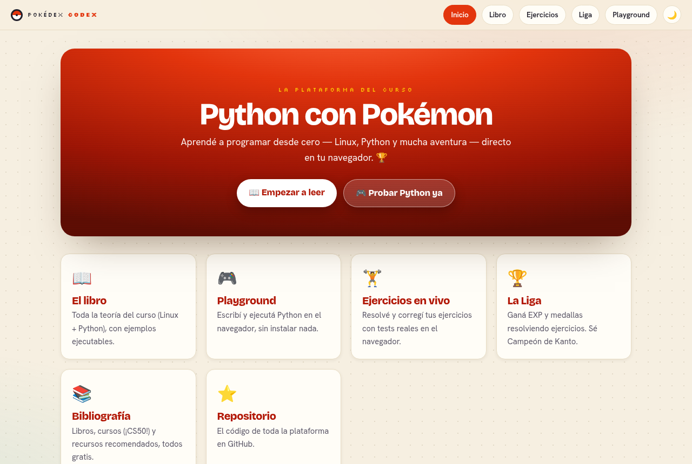
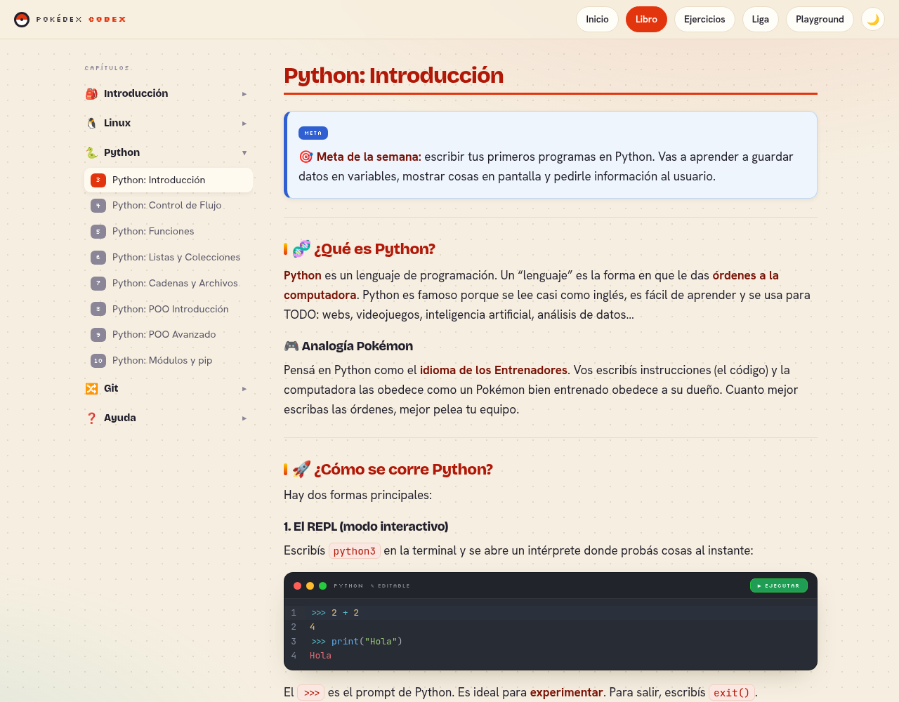
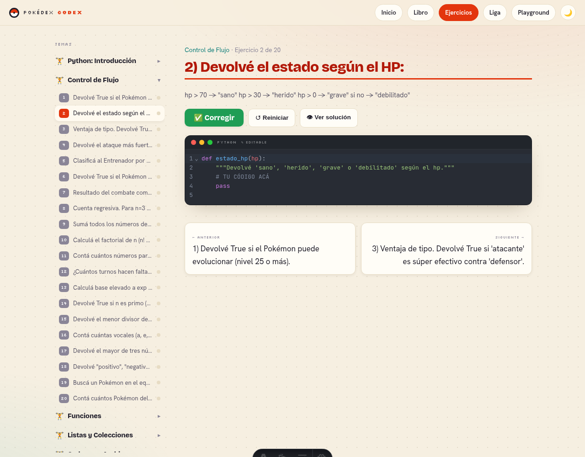
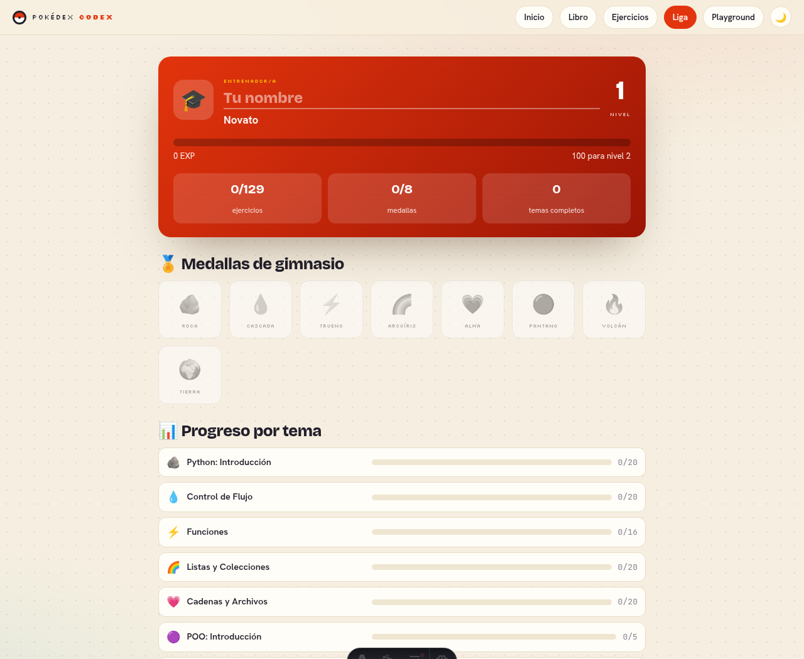

# 🔴⚪ Python con Pokémon — Plataforma web 🐍

[](https://felipendelicia.github.io/luca-journey/)


Curso interactivo de **Linux y Python desde cero**, con temática **Pokémon**, en español
argentino y pensado para principiantes absolutos. Todo corre **en el navegador** con
**Pyodide** (Python compilado a WebAssembly): no hay que instalar nada.

## 🌐 Entrá

### 👉 https://felipendelicia.github.io/luca-journey/

- 📖 **Libro** — toda la teoría, con ejemplos de código que **editás y ejecutás** ahí mismo.
- 🏋️ **Ejercicios** — resolvé cada ejercicio y **corregilo con los tests reales** en el navegador.
- 🏆 **La Liga** — ganá EXP y medallas resolviendo; tu progreso se guarda solo.
- 🎮 **Playground** — escribí y corré Python libremente.
- 📚 **Bibliografía** — libros y cursos recomendados.

## 📸 Capturas

| Inicio | El libro (con código ejecutable) |
|:---:|:---:|
|  |  |
| **Ejercicios (corrección en vivo)** | **La Liga** |
|  |  |

## 🛠️ Desarrollo

Todo vive en **`web/`** (app [Astro](https://astro.build)).

```bash
cd web
npm install
npm run dev        # http://localhost:4321  (con hot-reload)
```

Build (genera el sitio en `../docs`, que publica GitHub Pages):

```bash
npm run build
```

## 📁 Estructura

```
web/                      la app Astro (lo único que se mantiene)
  src/content/libro/      la teoría del libro (markdown, una sola fuente)
  src/ejercicios/<tema>/  ejercicios.py + soluciones.py + test_ejercicios.py por tema
  src/pages/              inicio, libro, ejercicios, liga, playground, recursos
  src/lib/runner.py       corrige los ejercicios con pytest en Pyodide
  scripts/sync-ejercicios.mjs  divide los ejercicios y arma src/data/ejercicios.json
docs/                     build publicado en GitHub Pages
```

Licencia [MIT](LICENSE).
